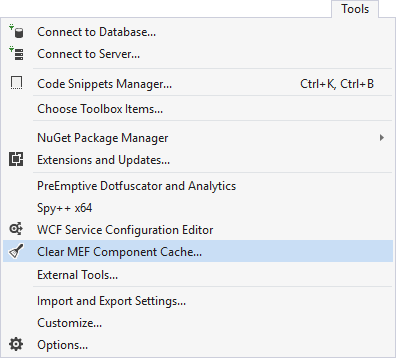

# Clear Component Cache

A Visual Studio extension that clears the MEF (Managed Extensibility Framework) cache.

Download the extension at the
[VS Gallery](https://visualstudiogallery.msdn.microsoft.com/22b94661-70c7-4a93-9ca3-8b6dd45f47cd)
or get the
[nightly build](http://vsixgallery.com/extension/f5028141-9dd0-4ac4-ae6d-0481ae9a940d/)

## What does it do?
This extension clears the MEF cache on disk and lets Visual Studio rebuild it. The
reason for clearing the MEF cache is that it can become corrupted. This ususally
happens when installing or updating extensions or other Visual Studio components.

Typical errors that can be solved by clearing the component cache are:

- Could not load package exception
- Could not load assembly exception
- Composition error when opening files
- Missing syntax highlighting of some languages in VS

The Visual Studio component cache is located at
**%localappdata%\Microsoft\VisualStudio\14.0\ComponentModelCache**. This extension
makes it easy to delete that folder so you don't have to remember the location of
the cache directory.

## Using the extension
In Visual Studio's top menu under Tools, a new command is now visible:

Clicking the **Clear MEF Component Cache** button will prompt you to confirm
and then restart Visual Studio.

Restarting Visual Studio will automatically trigger a reconstruction of the
MEF cache. This is a safe operation that doesn't cause any unwanted side effects.

## /RootSuffix support
It is unlikely you use the `/rootSuffix` command line switch and can therefore
just ignore this section.

If you use any root suffix when you start Visual Studio, then those will
be honored when deleting the cache. This extension will automatically delete the
cache belonging to the current root suffix.

Read more about the
[/RootSuffix command line switch](http://blog.slaks.net/2014-01-27/creating-multiple-visual-studio-profiles-with-rootsuffix/).

## License
[Apache 2.0](LICENSE)